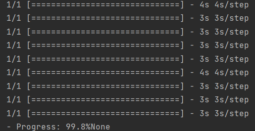
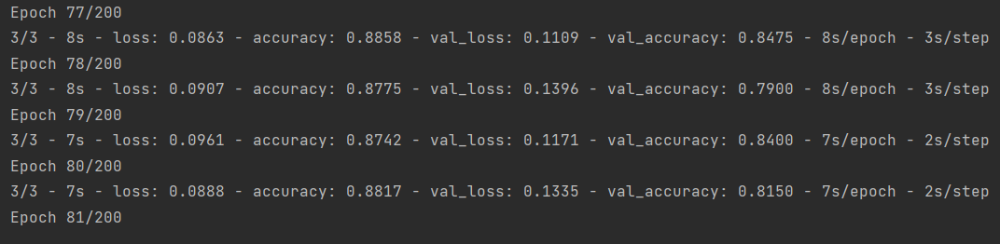
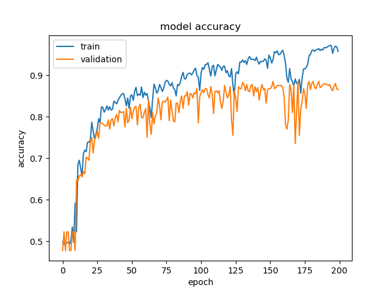
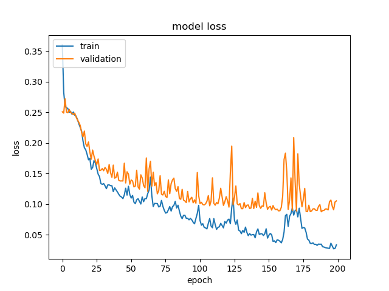

### 环境安装：

1. 预先installPython依赖包

2. model需要下载imagenet权重文件，需保证网络畅通，可能需要挂VPN

### 目录结构：

1. chunkTrain.h5为VGG16对训练集卷积后的输出值

2. chunkTest.h5为VGG16对测试集卷积后的输出值

3. vd.hdf5为训练好后保存的模型

### 数据集链接：

​	请预先下载好数据集。

   [https://www.kaggle.com/datasets/mohamedmustafa/real-life-violence-situations-dataset](https://www.kaggle.com/datasets/mohamedmustafa/real-life-violence-situations-dataset)

### 启动过程：

1. 将数据集文件中的所有视频放至./video目录下。注意是所有视频，不必区分训练、验证、测试集，划分已在代码中完成。
2. 使用Pycharm打开项目。
3. 在Pycharm中单击右键并点击运行。
4. IDE中的Console将会输出处理视频帧的信息以及epoch的处理进度条信息。
5. 因数据量较大，处理时间较长，大约为2-3h。

### 本机运行截图：

- 保存VGG16的传输值以供后续模型使用：

> 

- 模型训练过程：

>  

- 模型评价：准确率和损失值

> 

> 